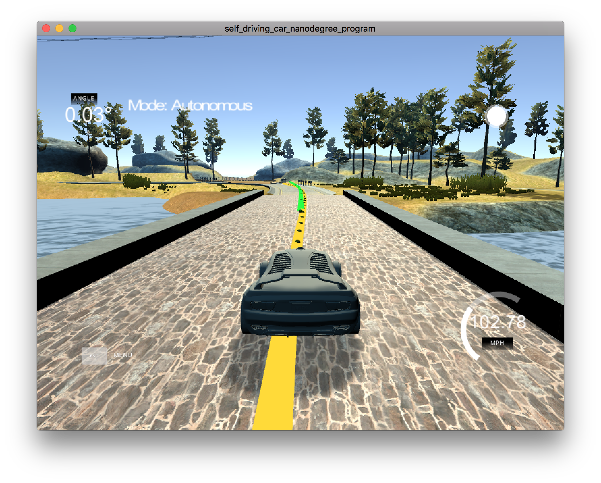
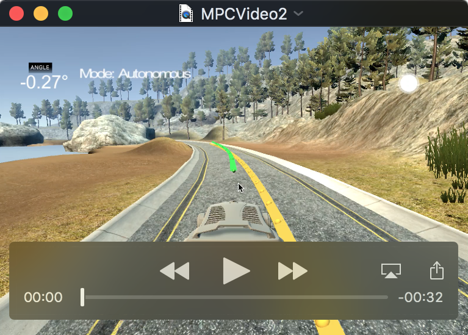

# Model Predictive Controller Project

[](http://www.udacity.com/drive)

Overview
---
This repository contains my submission for the Model Predictive Control Project, which is part of the curriculum for term 2 of the Udacity Self-Driving Car Engineer Nanodegree Program. The goal of this project is to  implement Model Predictive Control to drive the car around the lake race track from the behavioral cloning [project](https://github.com/alangordon258/SelfDrivingCar-Term1-Proj3) in term1. The code for my model predictive controller can be found [here](./src). In this project we were not given the cross track error, we had to calculate it ourselves. Additionally, there's a 100 millisecond latency between actuations commands on top of the connection latency.  See the project rubric [here](https://review.udacity.com/#!/rubrics/896/view). 


[//]: # (Image References)

### How The Hyper Parameters Were Determined
The biggest challenge in this project was tuning the hyper parameters. 
The first set of parameters were N (the number of timesteps to model) and dt (the elapsed duration between timesteps). I started with the following values:

| Param Name | Param Value |
|:-----:|:-------------:|
| N  | 25  |
| dt  | 0.05  |

because these were the values mentioned in the course materials. This corresponds to modeling a time frame of 1.25 seconds. With these parameters the car would go around the track without crashing if I turned the reference velocity down to 30 mph. If the reference velocity was increased to 40 mph, the car would weave a little bit, but it stayed on the track. At 50 mph, the car would quickly go off the road. I tried increasing N to 50, but that only made the behavior worse. So I instead reduced N to 10. This improved the behavior, but the car would react slow to turns often running wide. I figured that with the 0.1 second latency, the simulation would need to model the state of the car further down the road. So I left N at 10 and then increased dt to 0.1. 

| Param Name | Param Value |
|:-----:|:-------------:|
| N  | 10  |
| dt  | 0.10  |

This worked well. With these parameters I was able to turn the reference velocity up to 60 MPH. Interestingly, if I tried increasing N to 12 after I had increased dt to 0.10, the car would quickly go unstable and go off the track. So the values above became my chosen values. But I wanted to go faster, so I started playing around with other parameters.

Because a control latency of 0.1 seconds was deliberately inserted into the system, I reasoned that I could improve the driving behavior of our car if we used the kinematic model to predict the car's state 0.1 seconds in the future and use that as the point where the control actuation would be applied. Doing this made the car more stable and I was able to increase the reference velocity to 70 mph. However, at these speeds the car was running up on the curb some times.

Next I tried changing the cost function. Putting a constant greater than 1.0 in front of a term in the cost function will cause that term to be lower in magnitude in the solution. For example putting a constant greater than 1 in front of the CTE portion of the cost function as follows:
```sh
fg[0]+=10*CppAD::pow(vars[cte_start + t],2);
```
Will cause the solver to find a solution where the cte is lower i.e. the car will stay closer to the center of the track. I started out using a value of 10 as the multiplier in front of both the CTE and EPSI terms in the cost function. Interestingly I found that setting the multiplier to 10 improved the cars behavior, but setting it to 100 caused the car quickly to crash. This stood to reason as we want to boost the influence of the CTE and EPSI term's influence on the final solution, but we don't want to boost that influence so much that it completely overwhelms the influence of everything else in the cost function.
```sh
fg[0]+=hyper_params[CostFunctionParts::CTE]*CppAD::pow(vars[cte_start + t],2);
```
With this change, I was able to up the speed to 80. My green line was getting a little "wonky" at times, but the car was staying on the track, staying off the curbs and driving well and fast. But like Oliver Twist, I wanted more.

I think the values that I had for N and dt were optimal, so I decided to do dimensional analysis on the cost function. I learned from my academic and professional experience with machine learning that the features you are optimizing should be scaled so that they are of a similar magnitude. Typically they are scaled to be in the range -1<=x<=1. I decided not to scale to a magnitude of 1, but I wanted to scale each component of the cost function to the same order of magnitude so that each component contributes in a meaningful way to the final result. In order to do this I looked at the square of the values for each of the components as they are being logged. I then calculated a scaling factor so that each will have a similar magnitude. Details of this process can be seen in the table below.

| Component | Avg Value | Value^2 |Scaling Const.|Magnitude|
|:-----:|:-------------:|:-----:|:-----:|:-----:|
| cte  | 0.5  | 0.25  |  100 | 25 | 
| epsi  | 0.5  | 0.25  |  100 | 25 | 
| v-vref  | 5  |  25  |  1 | 25 |
| steering  | 0.05  | 0.0025  |  10000 | 25 |
| throttle  | 0.5  | 0.25  |  100 | 25 | 
| speed*steering  | 0.5  | 0.25  |  100 | 25 | 
| delta steering  | 0.05  | 0.0025  |  10000 | 25 |
| delta throttle  | 0.5  | 0.25  |  100 | 25 | 

The value in the fourth column of the table above is the constant that is applied to the cost component shown in column 1. An example is shown below.
```sh
fg[0]+=hyperparams[CostFunctionParts::CTE]*CppAD::pow(vars[cte_start + t], 2);
```

I tried using these hyperparameters and it was immediately clear that the car was driving much better, however it was going a little slow. Is upped the reference velocity to 100 and increased the hyperparameter associated with the (v-vref) component of the cost function to 10. With these changes, the car started going really fast while exhibiting excellent stability. One thing I did notice is that the car was following a "racing line" i.e. it was swinging wide and "clipping" the apexes of each corner like a race driver would. This made the car fast. However it does mean that I wasn't minimizing the cte. I was maximizing speed. Had the car been on a street you would want it to following a path that more approximated the center line of a lane. But the "racing line" is the fastest way around a race track. To test my understanding I started increasing the scaling factor on the cte and epsi component. The point here is to increase the tendency of the car to following the center-line of the track. Sure enough, increasing the scaling factor on the cte and epsi components moved the car towards the center of the track in corners, but also caused the car to start crashing. With 400 for the cte and espi hyperparameters, the car crashed at the first sharp corner. At 300 it would run for a while before crashing. Eventually I found 250 for both the cte and epsi to be a good compromise value. With this value, the car did not crash and it did not drive over the curbs on every corner. I also upped the reference velocity to 110. At this point I decided that I had optimized enough. A video of the car is shown below. 

[](https://youtu.be/nhavxuQhzYk)

You can see that it actually maintains a speed greater than 100 mph most of  the way around the track. This is significantly faster than what I was able to achieve with a PID controller. This controller also did not have a tendency to weave slightly back and forth which the PID controller would do. This made me think of a friend of mine who is now on his second Audi car equipped with automatic lane keeping. He complained to me that his older car kept the car in its lane, but had a tendency to wander a little bit back and forth. His newer Audi does not do this. It made me wander if Audi switched out a PID controller in the earlier version for a model predictive controller or something similar in its newer models. 

Another interesting thing I discovered while shooting this video is that this algorithm does not suffer from the limitation of the PID controller in that even a slight change to the sample frequency (caused by tring to capture a video of the screen) did not cause the car to crash. 